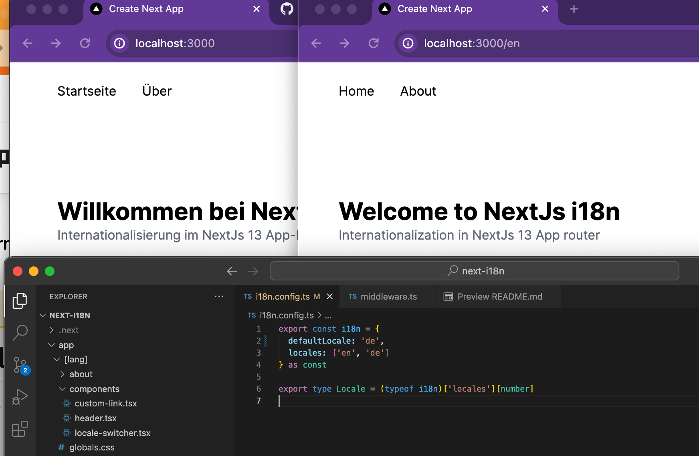
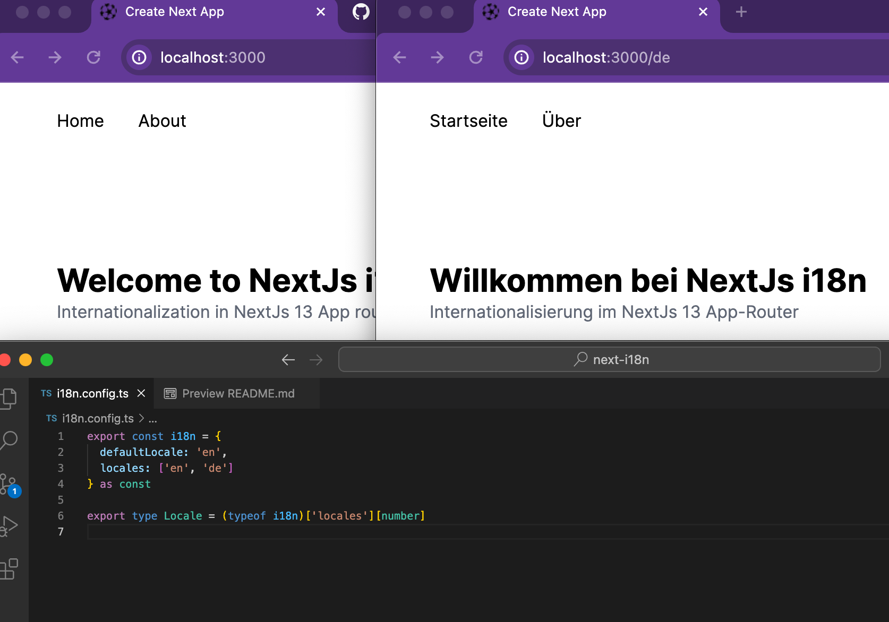

I modified https://www.youtube.com/watch?v=hA0Wp3KQYGU code.

I fixed 'defaultLocale' in the 'i18n.config.ts' isn't reflected. (remove
reflecting user's preferred locale)

1. defaultLocale === 'de' 

2. defaultLocale === 'en' 
